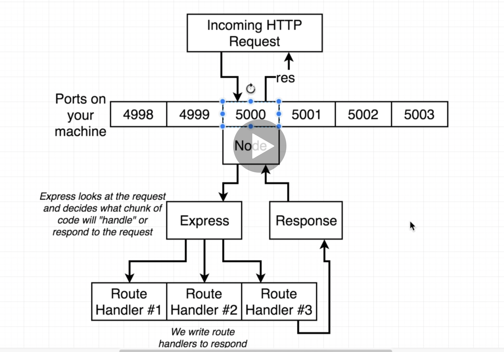
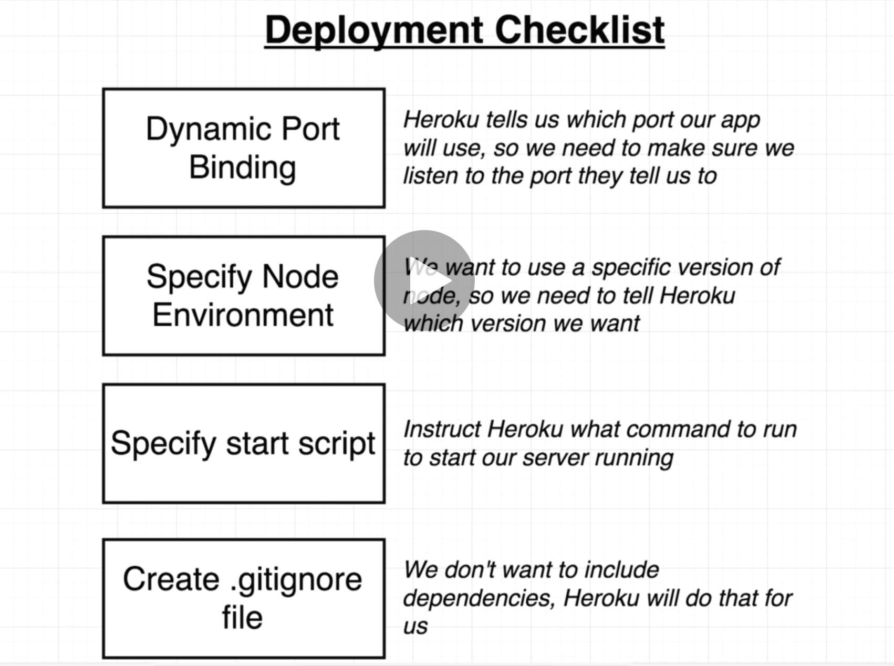
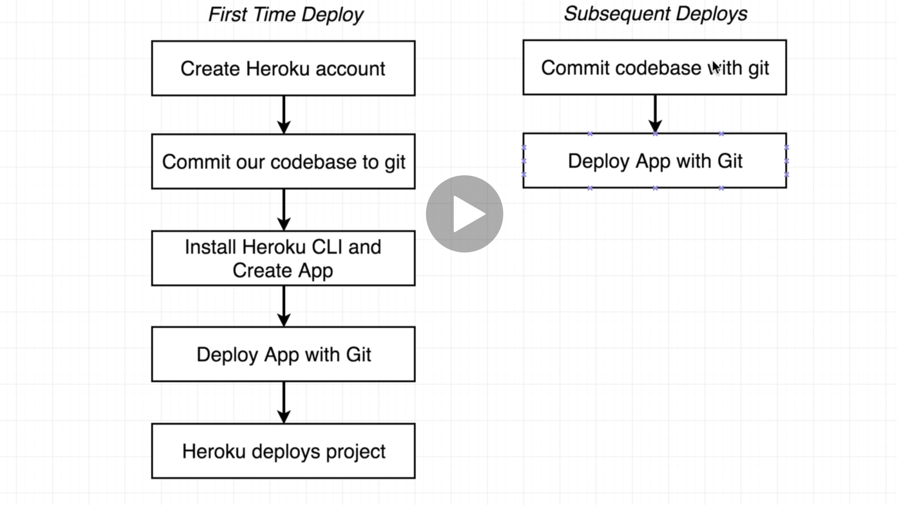

# MERN STACK BOILER PLATE - step by step
- mkdir directory_name
- cd directory_name
- npm init
- npm install --save express
- create index.js
- const express = require('express');
- const app = express();
- app.get('/', (req, res) => {
  res.send({ hi: "there" });
})
- const PORT = process.env.PORT || 5000;
- app.listen(PORT);

## Node flow  


## Checklist  


- ADD below code to the package.json, rigth below "main":"index.js"  
```
"engines": {
  "node":"14.17.6",
  "npm":"6.14.15"
},
```  
- ADD update "scripts"
```
"scripts": {
    "start": "node index.js"
  },
  ```

- add .gitignore  

## Deployment list


- git init
- git add .
- heroku login
- heroku create
- git remote add heroku <'heroku git remote path'>
- git push heroku master


