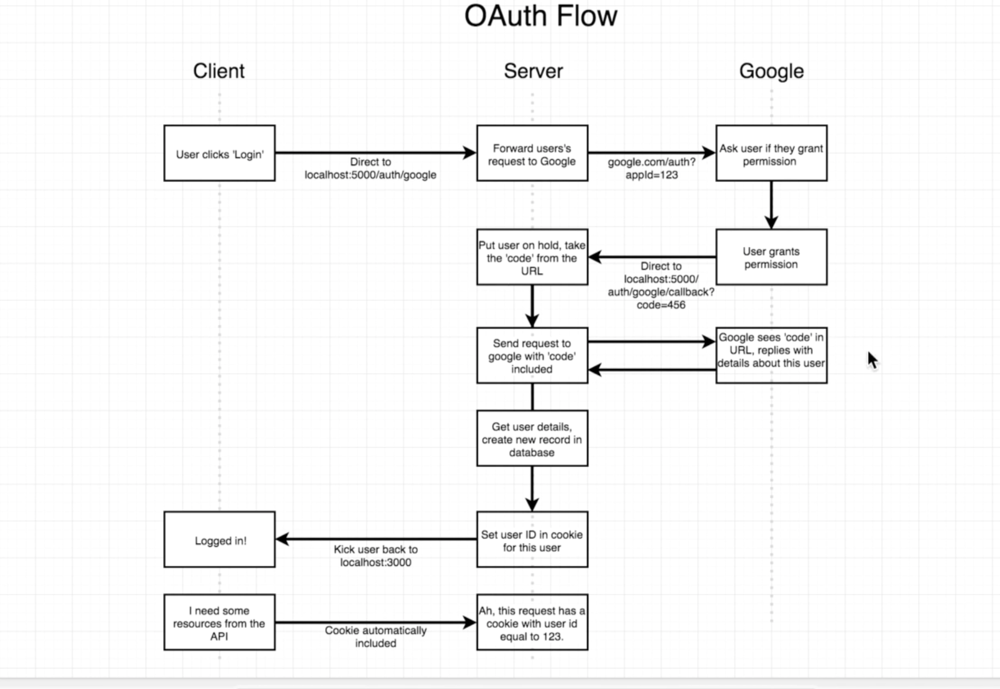
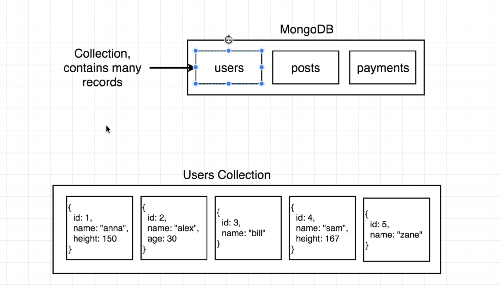

# MERN STACK BOILER PLATE - step by step
- mkdir directory_name
- cd directory_name
- npm init
- npm install --save express
- create index.js
- const express = require('express'); <!-- index.js -->
- const app = express(); <!-- index.js -->
<!-- - app.get('/', (req, res) => {
  res.send({ hi: "there" });
}) -->
- const PORT = process.env.PORT || 5000;
- app.listen(PORT);

## Node flow  


## Checklist  


- ADD below code to the package.json, rigth below "main":"index.js"  
```js
"engines": {
  "node":"14.17.6",
  "npm":"6.14.15"
},
```  
- ADD update "scripts"
```js
"scripts": {
    "start": "node index.js"
  },
  ```

- add .gitignore  

## Deployment list


- git init
- git add .
- git branch -M main
- git push origin main
- heroku login
- heroku create
- git remote add heroku <'heroku git remote path'>
- git push heroku main


## OAuth Flow  
  
- npm install --save passport passport-google-oauth20
- const passport = require('passport'); <!-- index.js -->
- const GoogleStrategy = require('passport-google-oauth20').Strategy;<!-- index.js -->


- create folder "config", with "keys.js" 
- add credentials to keys.js 

```js
 module.exports = {
  googleClientID: 'xxx',
  googleClientSecret: 'xxx'
}
```
- add "keys.js" to gitignore
- const keys = require('./config/keys.js') <!-- index.js -->
- passport.use(new GoogleStrategy({clientID:keys.googleClientID, clientSecret:keys.googleClientSecret,callbackURL:'/auth/google/callback'},(accessToken)=>{console.log(accessToken)}));<!-- index.js -->
- app.get('/auth/google', passport.authenticate('google', {scope: ['profile','email']}))<!-- index.js -->
- npm install --save nodemon
- Update "scripts"
```js
"scripts": {
    "start": "node index.js",
    "dev": "nodemon index.js"
  },
  ```

  - create routes folder and authRoutes.js file
  - create services folder and passport.js file 
  - npm install --save mongoose
  - const mongoose = require('mongoose');<!-- index.js -->
  - mongoose.connect(keys.mongoURI);
  - create folder models and user.js file
  - npm install --save cookie-session
  - npx create-react-app client
  - Update "scripts"
```js
"scripts": {
    "start": "node index.js",
    "server": "nodemon index.js",
    "client": "npm run start --prefix client",
    "dev": "concurrently \"npm run server\" \"npm run client\""
  },
  ```
  - npm install --save concurrently <!--SERVER-->
  - npm install http-proxy-middleware@2.0.1<!--CLIENT-->

  https://www.npmjs.com/package/axios
  - npm install axios
  





